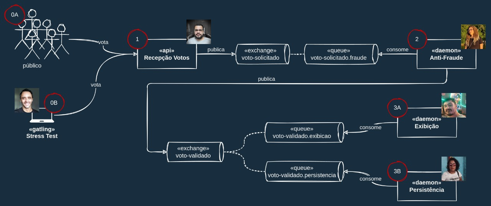

# Live Sistema de Votação

[live do desenvolvimento de um sistema distribuído de votação](http://youtube.com.br)

## Visão Geral

O desenho abaixo mostra uma visão geral do sistema de votação implementado na live.

0A - Pessoal que vota: ...

0B - Teste de Performance: ...

1 - Recepção dos Votos (API): ...

2 - Detecção de Fraudes (Daemon): ...

3A - Detecção de Fraudes (Daemon): ...

3B - Detecção de Fraudes (Daemon): ...
